```{r setup, include=FALSE}
knitr::opts_chunk$set(echo = FALSE)
library(tidyverse); library(quanteda)

dfm <- readRDS("./data/dfm.RData")
```

## Shiny {.build}

A **Shiny** app is a web page (UI) connected to a computer running a live R session (Server)

```{r, out.width = "800px"}
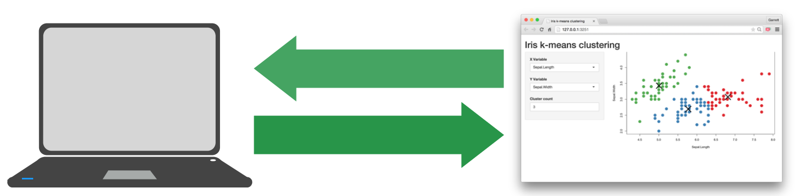
```

Users can manipulate the UI, which will cause the server to update the UI's displays (by running R code).

## Russian Troll Cooccurrence Plot

<div style="margin-left:-20px; margin-top:-10px; width:100%; height:100%">
```{r, echo=FALSE, message=FALSE, fig.width=8}
inputPanel(
  sliderInput("top", "Top X Words", value = 30, min = 10, max = 100, step = 5),
  sliderInput("edgeAlpha", "Edge Transparency", value = 0.8, min = 0, max = 1, step = 0.05),
  sliderInput("edgeSize", "Edge Thickness", value = 4, min = 1, max = 6, step = 0.5)
)
  
renderPlot({
  fcm(dfm) %>%
    fcm_select(names(topfeatures(dfm, input$top))) %>%
    textplot_network(min_freq = 0.1, edge_alpha = input$edgeAlpha, edge_size = input$edgeSize)
  })
```
</div>

----

```{r, out.width = "800px"}
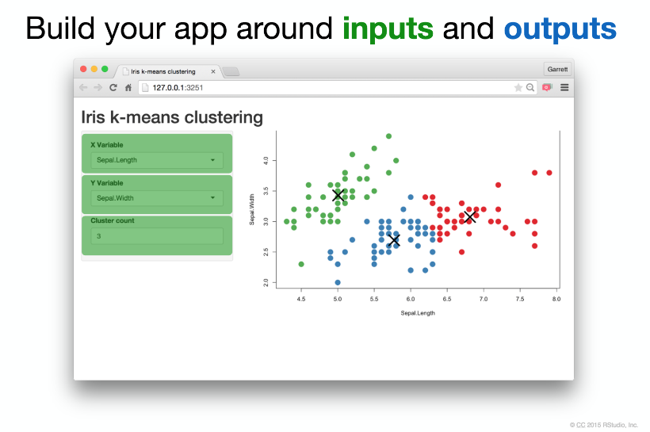
```

----

```{r, out.width = "800px"}
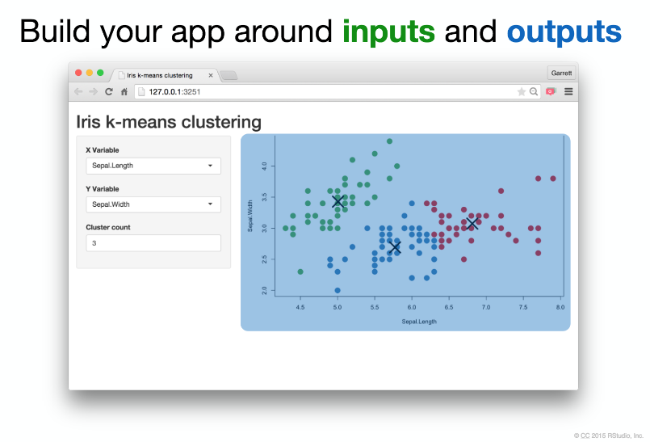
```

----

```{r, out.width = "800px"}
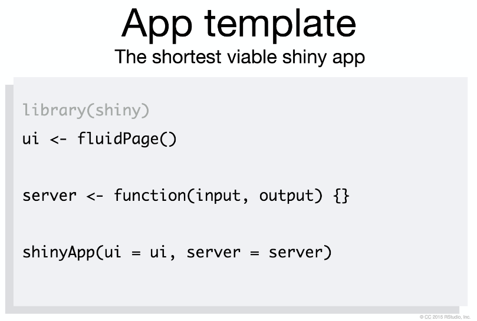
```

## Try This

1. Open a new .R file

2. Type this into the file. (Do you have the shiny package?)

    ```{r, out.width = "600px"}
    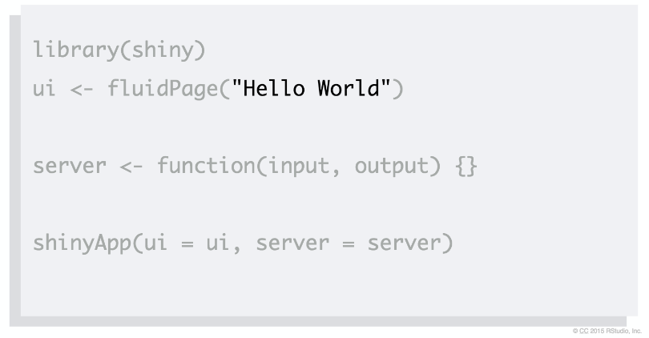
    ```

3. Click "Run"

# User Interface: `ui()` function

## `fluidPage()`

```{r, out.width = "800px"}
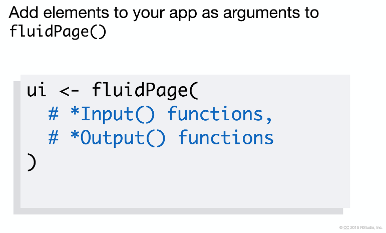
```

## Example

```{r, out.width = "800px"}
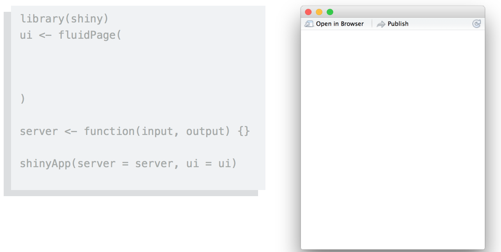
```

## Example

```{r, out.width = "800px"}
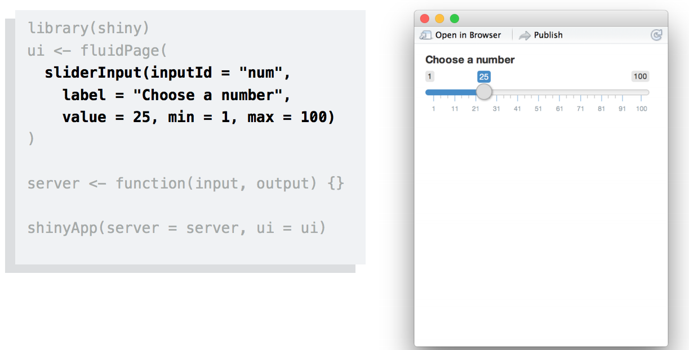
```

## Input Syntax

```{r, out.width = "800px"}
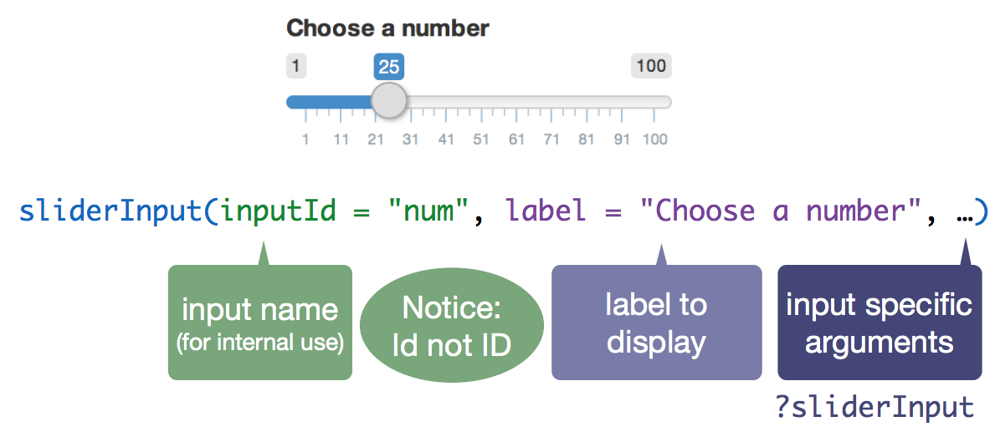
```

## Inputs

```{r, out.width = "800px"}
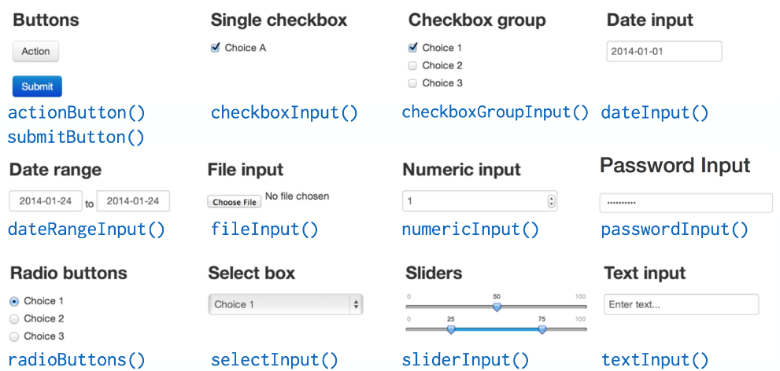
```

There are multiple common `Input()` functions.

## What's in an Input function? HTML

```{r, out.width = "800px"}
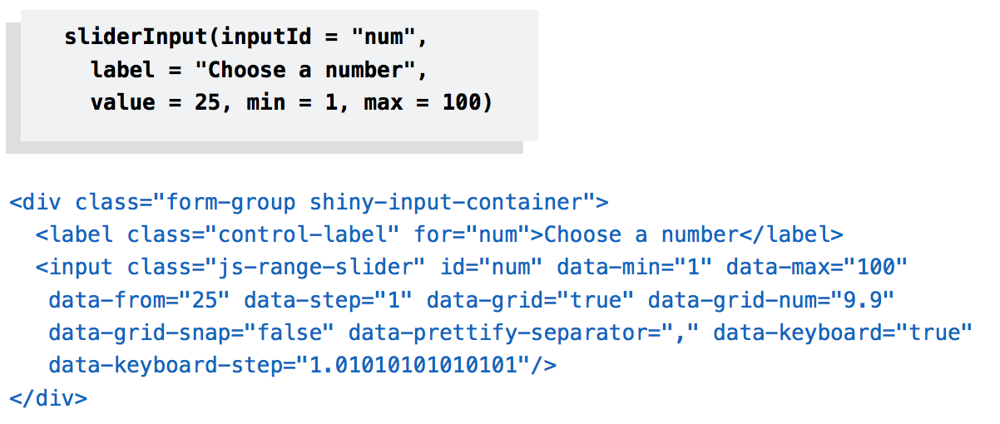
```

## Output Syntax

```{r, out.width = "800px"}
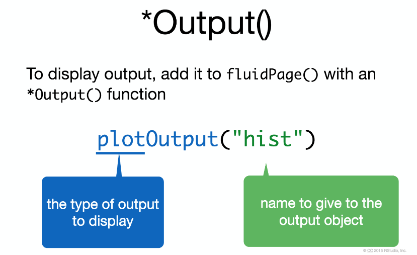
```

## Output Options

```{r, out.width = "800px"}
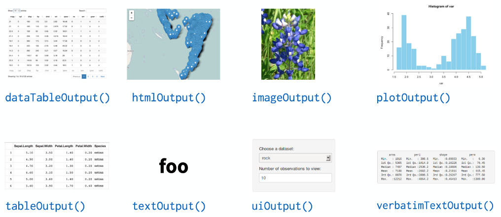
```

## Example

```{r, out.width = "800px"}
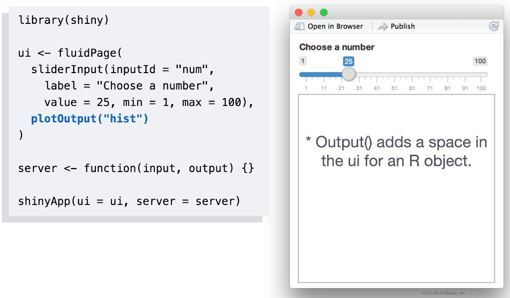
```

## Example

```{r, out.width = "800px"}
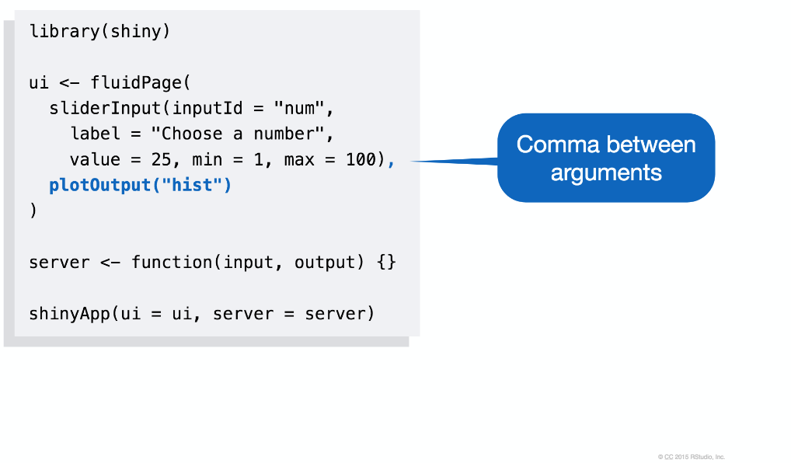
```

## Example

```{r, out.width = "800px"}
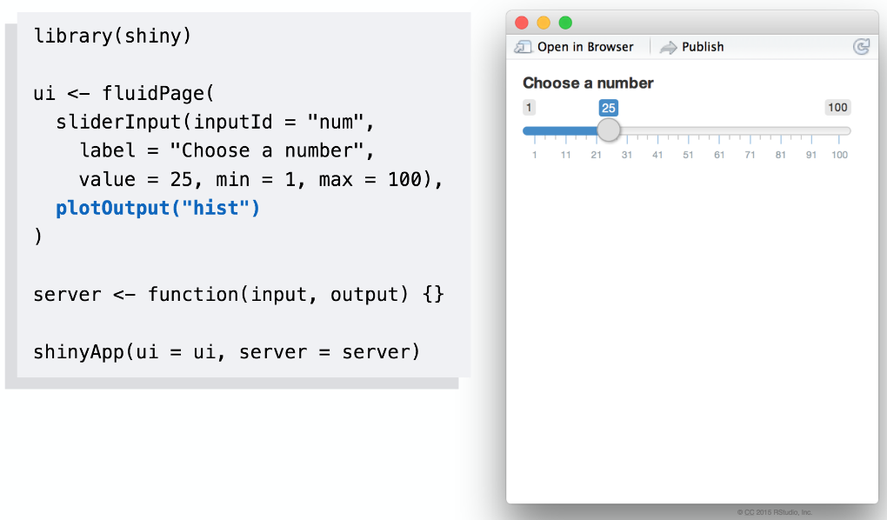
```

## Example

```{r, out.width = "800px"}
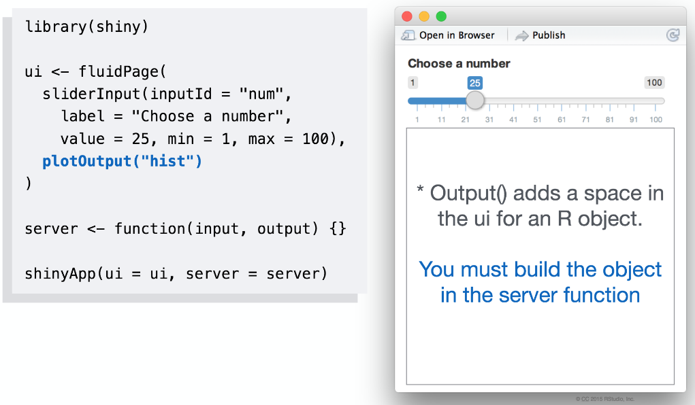
```

# ui Layouts

## Layouts

```{r, out.width = "800px"}
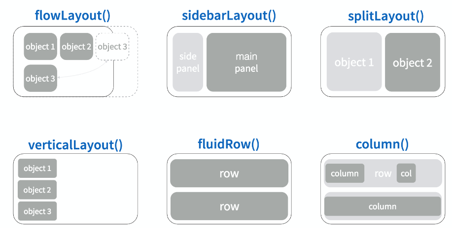
```

## `sidebarLayout()`

```{r, out.width = "800px"}
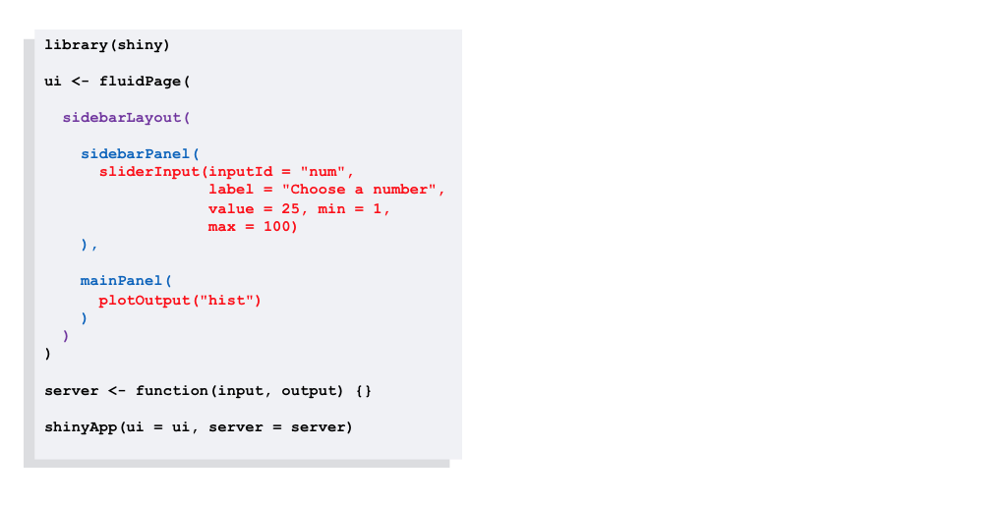
```

We can use template layouts to organize our objects.

## `sidebarLayout()`

```{r, out.width = "800px"}
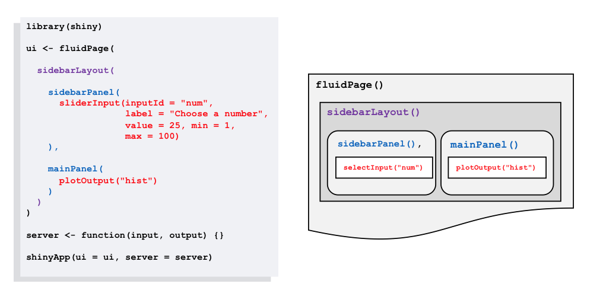
```

## `sidebarLayout()`

```{r, out.width = "800px"}
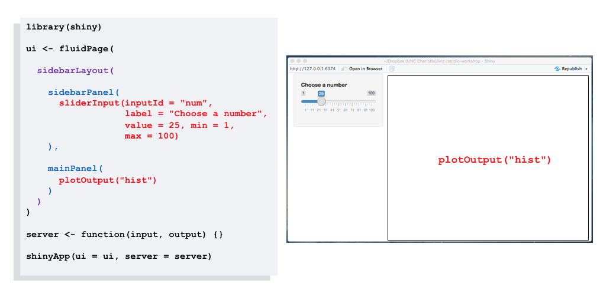
```

## html tags if you know HTML

```{r, out.width = "800px"}
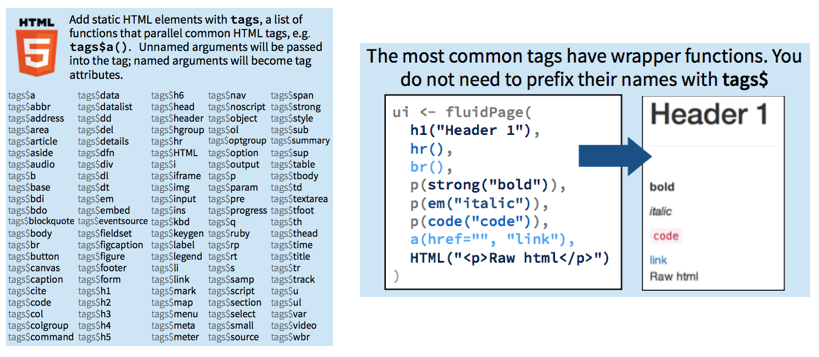
```

# Server: `server()` function

---

```{r, out.width = "800px"}
knitr::include_graphics("img/shiny/shiny-server1.png")
```

---

```{r, out.width = "800px"}
knitr::include_graphics("img/shiny/shiny-server2.png")
```

---

```{r, out.width = "800px"}
knitr::include_graphics("img/shiny/shiny-server2a.png")
```

---

```{r, out.width = "800px"}
knitr::include_graphics("img/shiny/shiny-server2b.png")
```

---

```{r, out.width = "800px"}
knitr::include_graphics("img/shiny/shiny-server2c.png")
```

---

```{r, out.width = "800px"}
knitr::include_graphics("img/shiny/shiny-server2d.png")
```

---

```{r, out.width = "800px"}
knitr::include_graphics("img/shiny/shiny-server3.png")
```

---

```{r, out.width = "800px"}
knitr::include_graphics("img/shiny/shiny-server4.png")
```

---

```{r, out.width = "800px"}
knitr::include_graphics("img/shiny/shiny-server5.png")
```

---

```{r, out.width = "800px"}
knitr::include_graphics("img/shiny/shiny-server6.png")
```

---

```{r, out.width = "800px"}
knitr::include_graphics("img/shiny/shiny-server-reactivity.png")
```

## Shiny: Output

```{r, out.width = "800px"}
knitr::include_graphics("img/shiny/shiny-server-output.png")
```

## Server Recap

```{r, out.width = "800px"}
knitr::include_graphics("img/shiny/shiny-server-recap.png")
```

## 15 minute Quick Assignment

Open the `app.R` file in the day1 folder.

Try these three tasks:

1. add a new slider that sets the number of breaks for the rnorm() function

2. add a textInput() that sets the name of the plot

3. add a actionButton() that updates the name of the plot (part 2) only when clicking (hint: see ?observeEvent)

# Deploying Apps to Shinyapps.io

---

```{r, out.width = "800px"}
knitr::include_graphics("img/shiny/shiny-shinyapps.png")
```

## Setup connection to ShinyApps.io

```{r, out.width = "700px"}
knitr::include_graphics("img/shiny/deploy1.gif")
```

## Setup connection to ShinyApps.io

```{r, out.width = "700px"}
knitr::include_graphics("img/shiny/deploy2.gif")
```

## Deploy to ShinyApps.io

```{r, out.width = "700px"}
knitr::include_graphics("img/shiny/deploy3.gif")
```

## Deploy to ShinyApps.io

```{r, out.width = "700px"}
knitr::include_graphics("img/shiny/deploy4.gif")
```

## Home Assignment #1

Use the Russian Troll code (`01-russian-trolls.R`) to create your own Shiny app.

It should include:

1.  A text input (i.e., what words to filter)

2.  A sidebar/main layout

3.  A plotly (via ggplot2) main output (i.e., daily time series of posts with filtered word)

Bonus points: Learn from <https://plot.ly/r/shinyapp-plotly-events/> on how to capture (and output) interactions.