```{r setup, include=FALSE}
knitr::opts_chunk$set(echo = FALSE)
library(tidyverse); library(png); library(jpeg)
```

## Tidyverse

The tidyverse is an opinionated collection of R packages designed for data science. 

All packages share an underlying philosophy ('tidy') and common APIs. 

```{r out.width = "400px", fig.align="center"}
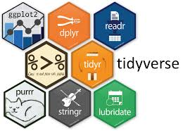
```

<https://www.tidyverse.org/>

## What are R packages?

```{r out.width = "800px", fig.align="center"}
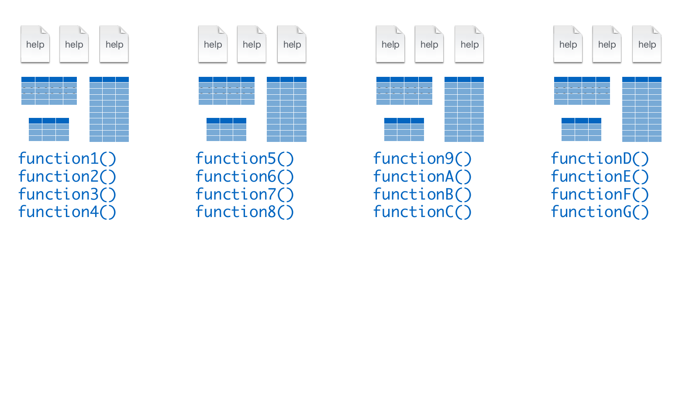
```

## What are R packages?

```{r out.width = "800px", fig.align="center"}
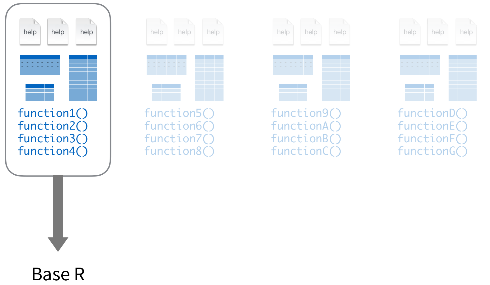
```

## What are R packages?

```{r out.width = "800px", fig.align="center"}
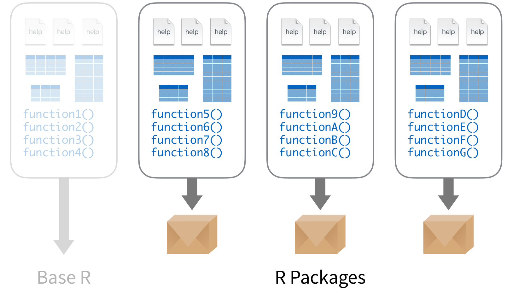
```

## How to install/run R packages?

```{r out.width = "800px", fig.align="center"}
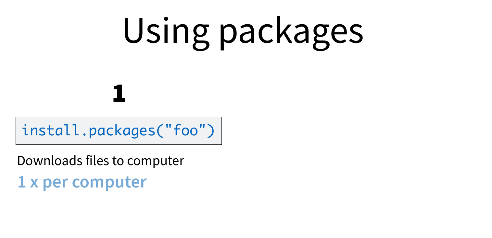
```

## How to install/run R packages?

```{r out.width = "800px", fig.align="center"}
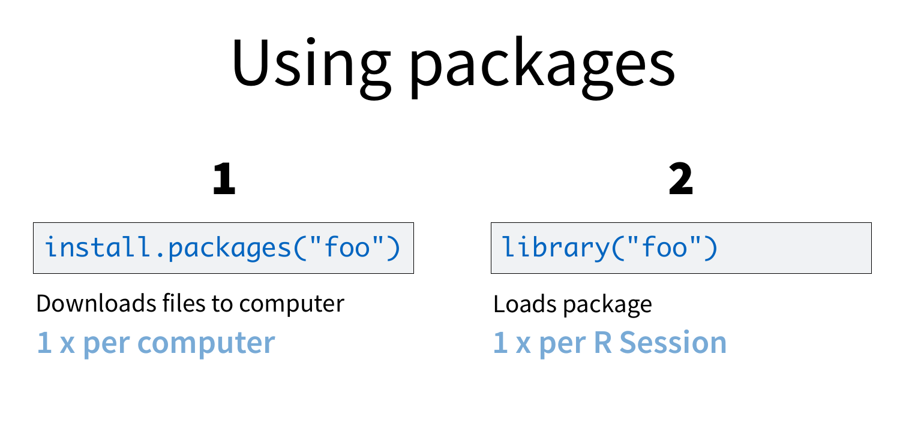
```

----

```{r out.width = "800px", fig.align="center"}
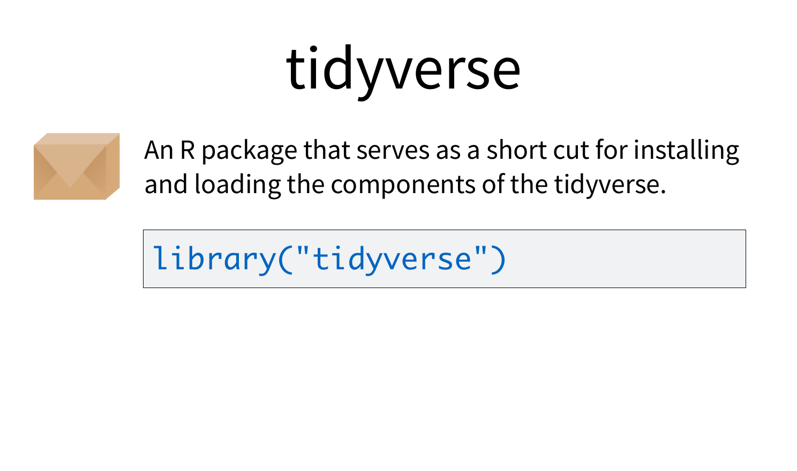
```

----

```{r out.width = "800px", fig.align="center"}
knitr::include_graphics("./img/tidyverse/packages7.png")
```

----

```{r out.width = "800px", fig.align="center"}
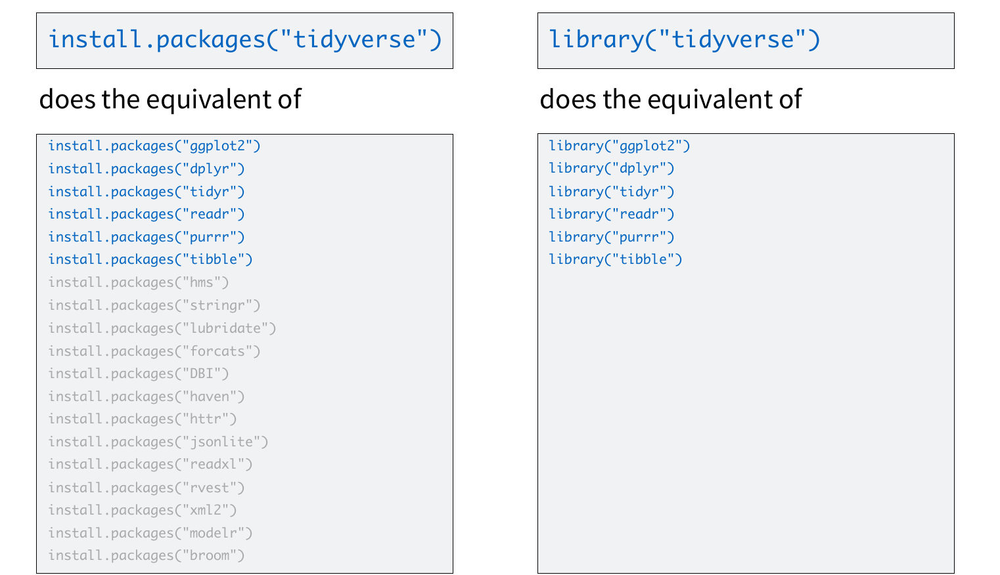
```

## Tidyverse Packages

```{r out.width = "800px", fig.align="center"}
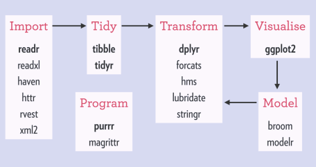
```

# Why tidyverse?

## Why tidyverse?

```{r out.width = "500px", fig.align="center"}

```

## Two Schools of Thought for Teaching R

**Base R first:** 

- Teach syntax such as $ and [[]], loops and conditionals, data types, etc. 

- Possibly introduce dplyr or data.table as alternatives.
    
**Tidyverse first:** 

- Keep a single-minded focus on data frames and dplyr; introduce ggplot2, tidyr and purrr shortly afterwards. 

- Introduce the %>% operator; skip syntax like [[]] and $ for  later. 

David Robinson: <http://varianceexplained.org/r/teach-tidyverse/>

## Teach the Tidyverse to Beginners {.build}

- Get students doing *powerful things quickly*.

- Don’t teach procedural logic (loops and conditionals)

  - Teach tables (group by and join).

- %>% ("piping") isn’t too hard for beginners

- "There’s only one way to do it"

- Conclusion: **You have permission not to be boring**

David Robinson: <http://varianceexplained.org/r/teach-tidyverse/>

David's [2018 RStudio::conf talk on teaching tidyverse](https://www.rstudio.com/resources/videos/teach-the-tidyverse-to-beginners/)

# What is tidy?

## tidy data

```{r out.width = "800px", fig.align="center"}
knitr::include_graphics("./img/tidyverse/tidy-1.png")
```

- Each variable must have its own column.
- Each observation must have its own row.
- Each value must have its own cell.

<http://r4ds.had.co.nz/tidy-data.html>

## tidying data: example 1

For example, which of these two datasets are tidy?

**Tuberculous Cases for Afghanistan, Brazil & China: 1999-2000**

```{r}
table1
```

## tidying data: example 2

```{r}
table2
```


## tidying functions: `spread()`

```{r out.width = "800px", fig.align="center"}
knitr::include_graphics("./img/tidyverse/tidy-spread.png")
```

Replace reshape (R) and/or "pivot" (Excel) table function. 

<http://tidyr.tidyverse.org/>

## tidying with `spread()`

```{r echo = TRUE}
spread(table2, key = type, value = count)
```

The `gather()` function does the opposite (i.e., "unpivots")

## tidy principle

Functions are easiest to use when they are:

1.  **Simple**: They do one thing, and they do it well

2.  **Composable**:  They can be combined with other functions for multi-step operations

# Core packages: dplyr, ggplot2, piping (%>%)

## dplyr: Data Munging/Transformation

```{r out.width = "600px", fig.align="left"}
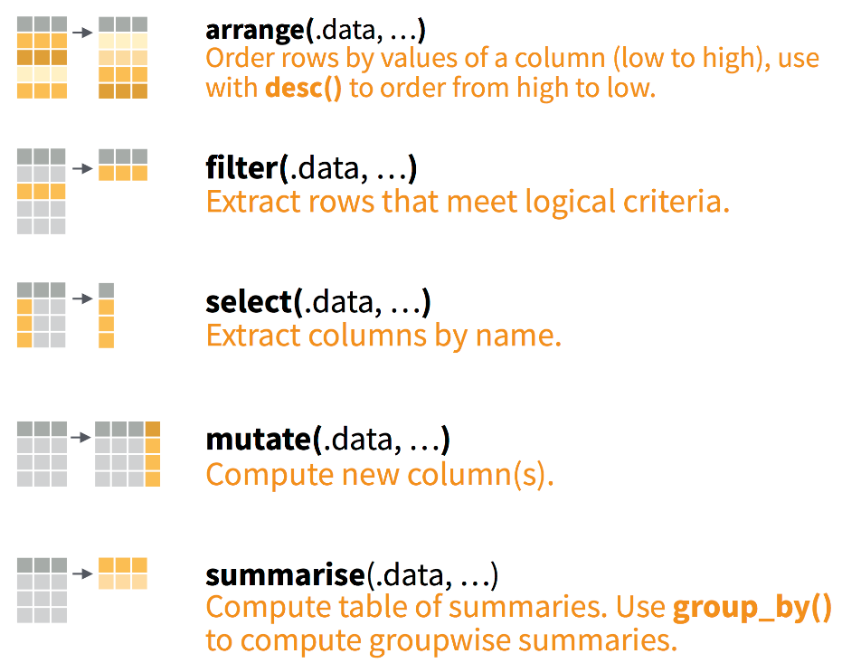
```

<http://dplyr.tidyverse.org/> [dplyr cheatsheet](https://www.rstudio.com/wp-content/uploads/2015/02/data-wrangling-cheatsheet.pdf)

## dplyr 

Load csv (readr)...

```{r echo=TRUE, message=FALSE, max.print=6}
tweets <- read_csv("../data/CharlotteTweets20Sample.csv") # readr function

select(tweets, body, postedTime, geo.type, point_long, point_lat) # view relevant columns
```

## dplyr 

Load csv (readr) and use dplyr functions.

```{r echo=TRUE, message=FALSE}
tweets <- read_csv("../data/CharlotteTweets20Sample.csv") # readr function

df <- group_by(tweets, geo.type) # group rows by column geo.type

summarise(df, Count = n()) # summarise (count) rows by geo.type
```

## dplyr with piping (%>%)

```{r echo=TRUE}
df <- group_by(tweets, geo.type)
summarise(df, Count = n())
```

```{r echo=TRUE}
tweets %>%
  group_by(geo.type) %>%
  summarise(Count=n())
```

## Piping gets really helpful for long commands...

```{r echo=TRUE}
tweets %>% 
  group_by(actor.location.displayName) %>%
  summarise(Count=n()) %>%
  arrange(desc(Count)) %>%
  head(n=5)
```

----

```{r out.width = "800px", fig.align="center"}
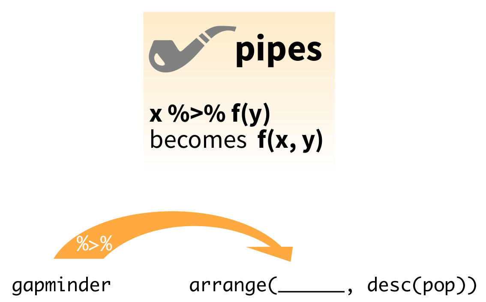
```

## ggplot2: Visualizations

```{r out.width = "800px", fig.align="center"}
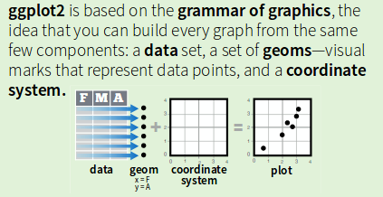
```

<http://ggplot2.tidyverse.org/> [ggplot2 cheatsheet](https://www.rstudio.com/wp-content/uploads/2015/03/ggplot2-cheatsheet.pdf)

## ggplot2: Visualizations

```{r out.width = "800px", fig.align="center"}
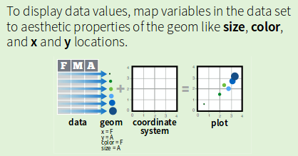
```

## ggplot2: Visualizations

```{r out.width = "800px", fig.align="center"}
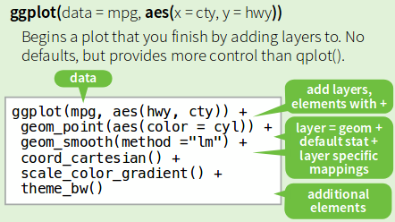
```

## ggplot2: Visualizations

```{r, include=FALSE}
df <- tweets %>% 
  group_by(actor.location.displayName) %>%
  summarise(Count=n()) %>%
  arrange(desc(Count)) %>%
  head(n=20)

df$actor.location.displayName <- factor(df$actor.location.displayName, 
                                        levels = df$actor.location.displayName[order(df$Count)])
```

```{r echo=TRUE}
df
```


## ggplot2: Visualizations

```{r fig.height=3.5, echo=TRUE}
ggplot(df, aes(x = actor.location.displayName, y = Count)) + 
  geom_bar(stat = "identity") + 
  coord_flip() +
  labs(x = "Profile Location", y = "Number of Tweets", 
       title = "Top 20 Profile Locations of Geolocated Clt Tweets")
```

# tidyverse advanced packages

## purrr: functional programming

```{r}
col <- c("name","height","mass","species")
starwars <- starwars[,col]
```

Let's start with the starwars dataset.

```{r echo=TRUE, message=FALSE}
head(starwars, n=5)
```

## purrr: functional programming

Regression of height on mass and by simplified species (species2)...

```{r echo=TRUE}
starwars %>%
  mutate(species2 = ifelse(species == "Human", "Human", "non-Human")) %>%
  split(.$species2) %>% # from base R
  map(~ lm(mass ~ height, data = .)) %>% # linear regression
  map(summary) %>% # keep the summary output
  map_dbl("r.squared")
```

<http://purrr.tidyverse.org/>

## broom: analyze model results

```{r echo=TRUE}
lmFit <- starwars %>%
  mutate(species2 = ifelse(species == "Human", "Human", "non-Human")) %>%
  split(.$species2) %>% # from base R
  map(~ lm(mass ~ height, data = .))
```

```{r echo=TRUE, message=FALSE}
library(broom)
tidy(lmFit[[1]]) # regression for human
```

```{r echo=TRUE}
tidy(lmFit[[2]]) # regression for non-human
```

<https://cran.r-project.org/web/packages/broom/vignettes/broom.html>

## rvest for webscraping

```{r echo=TRUE, message=FALSE}
library(rvest)
lego_movie <- read_html("http://www.imdb.com/title/tt1490017/")

lego_movie %>% 
  html_nodes("strong span") %>%
  html_text() %>%
  as.numeric()
```

## rvest for webscraping

```{r echo=TRUE, message=FALSE}
lego_movie %>%
  html_nodes("#titleCast .itemprop span") %>%
  html_text()
```

<https://github.com/hadley/rvest>

[SelectorGadget](https://cran.r-project.org/web/packages/rvest/vignettes/selectorgadget.html)

## tidytext for simple text analysis

```{r}
library(tidytext)
data("stop_words")
stop_words <- rbind(stop_words, data.frame(word = c("https","t.co","amp","http"), 
                                           lexicon = c("twitter","twitter","twitter","twitter")))
```

```{r echo=TRUE, message=FALSE}
library(tidytext)
tidy_tweets <- tweets %>% 
  unnest_tokens(word, body) %>% # tokenize body column
  anti_join(stop_words) %>% # remove stop words
  count(word, sort = TRUE) # count by tokens

head(tidy_tweets, n = 5)
```

<https://cran.r-project.org/web/packages/tidytext/vignettes/tidytext.html>

## Other important packages

- Reading in SPSS, SAS, STATA: **haven** <http://haven.tidyverse.org/>

- Reading in Excel files: **readxl** <http://readxl.tidyverse.org/>

- Date/time formats: **lubridate** <http://lubridate.tidyverse.org/>

- Strings: **stringr** <http://stringr.tidyverse.org/>

- Factors: **forcats** <http://forcats.tidyverse.org/>

- Package Management: **packrat** <https://rstudio.github.io/packrat/>

# Appendix - M

## R Markdown for Replication

This document is a R Markdown presentation (ioslides). 

Markdown is a simple formatting syntax for authoring HTML, PDF, and MS Word documents. 

```{r out.width = "250px", fig.align="center"}
knitr::include_graphics("./img/tidyverse/rmarkdown.png")
```

## gganimate

For examples on using R Markdown, see <http://rmarkdown.rstudio.com/gallery.html>.
